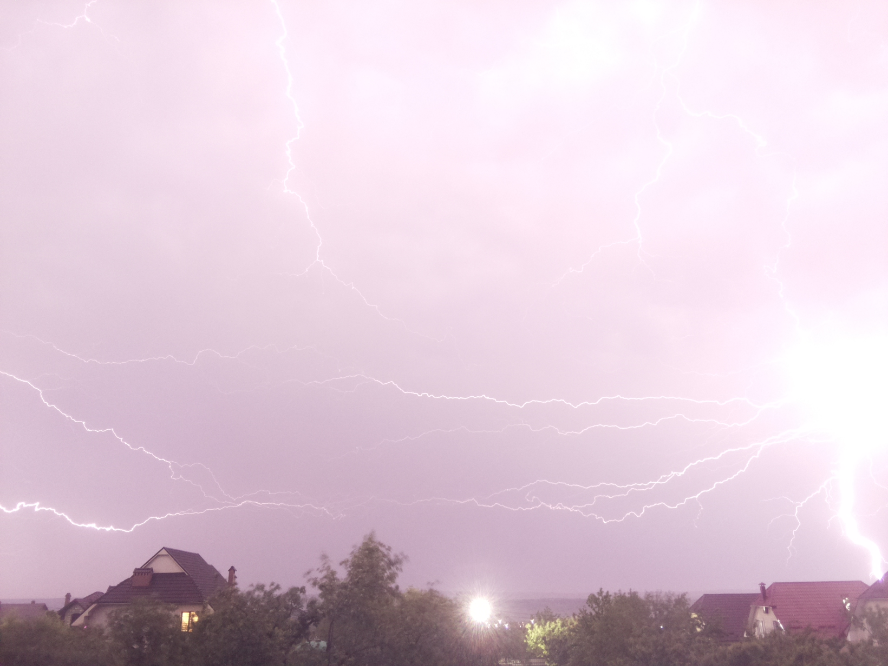
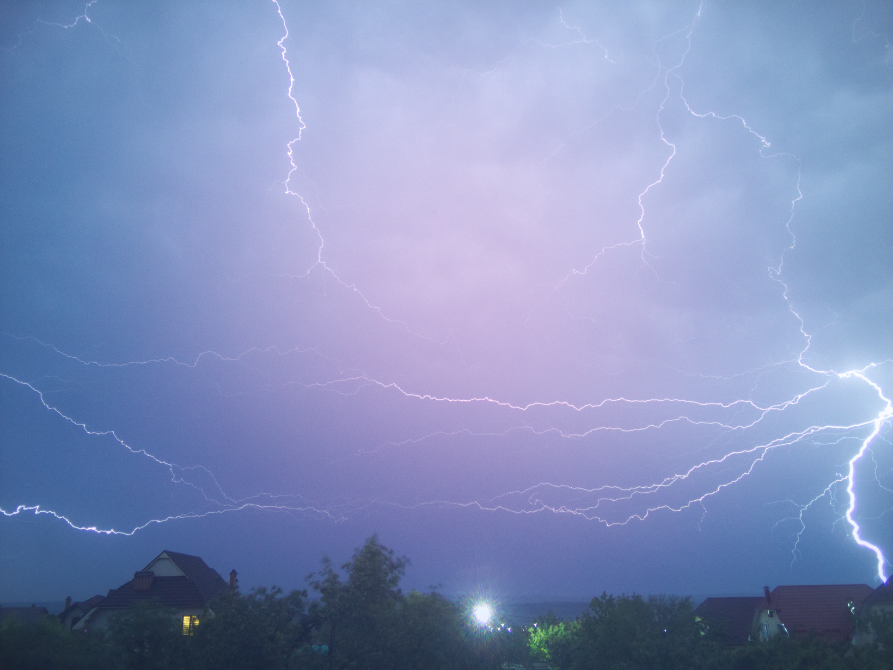

# PyDNG


Create Adobe DNG RAW files using Python.

## **Features**

*   8,10,12,14,16-bit precision
*   Lossless compression
*   DNG Tags ( extensible )

### Works with any **Bayer RAW** Data including native support for **Raspberry Pi cameras**:

*   OV5467 ( Raspberry Pi Camera Module V1 )
*   IMX219 ( Raspberry Pi Camera Module V2 )
*   IMX477 ( Raspberry Pi High Quality Camera )

### Changes from the original version:

*   Supports files shot in binned mode
*   Supports files which have RAW data in full res, but with binned thumbnail

### JPEG vs DNG:

 

---

## Instructions

Requires:

*   Python3
*   Numpy
*   ExifRead

### Install

```
# download
git clone https://github.com/fliker09/PyDNG
cd PyDNG

# install
pip3 install src/.

# or
pip install src/.
```

### How to use:

```
# python3 utility.py <options> <inputFilename>
python3 utility.py samples/imx477.jpg

# extract jpg thumbnail only
perl -0777 -pe 's/\xFF\xD9.*$/\xFF\xD9/s' samples/imx477.jpg > samples/imx477.extracted.jpg
```

---

## Credits

Source referenced from:

CanPi ( Jack ) | [color-matrices](https://www.raspberrypi.org/forums/viewtopic.php?f=43&t=278828)

Waveform80 | [picamera](https://github.com/waveform80/picamera)

Krontech | [chronos-utils](https://github.com/krontech/chronos-utils)

Andrew Baldwin | [MLVRawViewer](https://bitbucket.org/baldand/mlrawviewer)